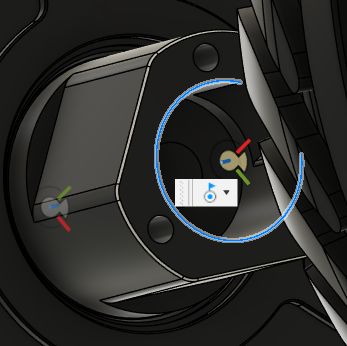
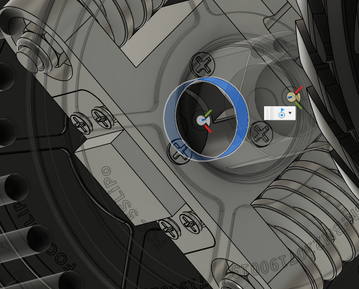
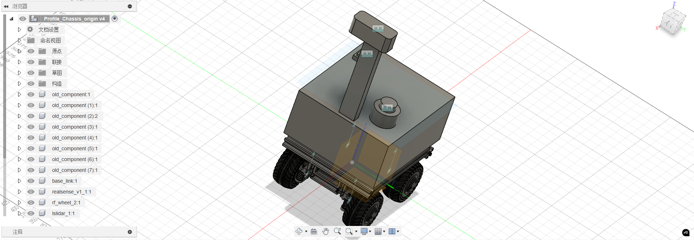
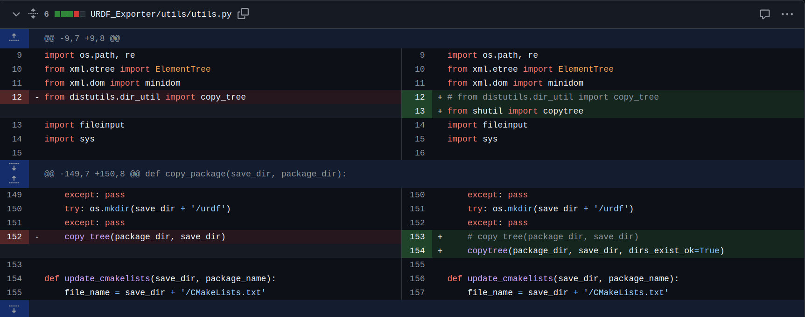
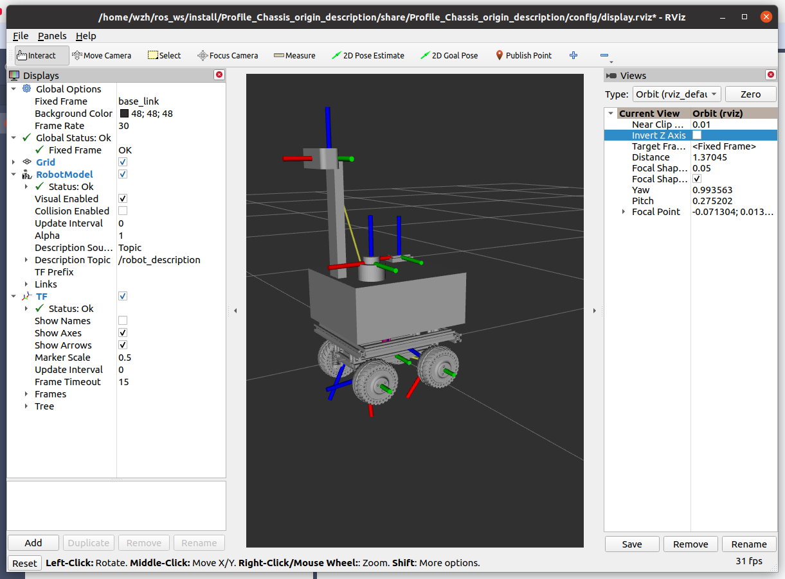
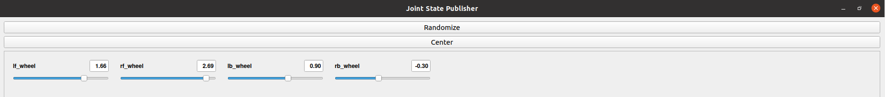

URDF： https://github.com/EmbodiedLLM/RoadRunner\_Description

装配体：https://www.jianguoyun.com/p/DekYivEQ7IupDRjN9f0FIAA


1. Fusion 360建模

   1. 主体部分：

   首先将整个主体部分的坐标系切换到标准位置，然后要将除四个轮子、雷达、imu、realsense的其他部分全部合并一个实体(base\_link)

   ⚠️合并实体之前要禁用“捕获历史设计”，然后将所有的零部件进行独立，否则会出现零件位置异常。

   * joint设定：

   所有接合部分均需要设定joint，wheel的component1设定为wheel，component2设定为base\_link

   ⚠️在设定轮子的joint-continuous时，可能会出现反转的情况，此时切换下component的对象，如下：

   

   

   * 文件结构：

   


* fusion2urdf

  教程：https://github.com/runtimerobotics/fusion360-urdf-ros2?tab=readme-ov-file#usage

  下载：https://github.com/syuntoku14/fusion2urdf


    1. 脚本修改：

  ModuleNotFoundError: No module named 'distutils' 和 FileExistsError的报错分别修改下面两行即可



  ```bash
 from shutil import copytree
 
 copytree(package_dir, save_dir, dirs_exist_ok=True)
  ```

  * 导出urdf：

  导出后的文件名为**name\_description**


  * rviz可视化：

  一些依赖包的下载：

  ```plain&#x20;text
# <ros2_version>为对应的ros2版本
sudo apt-get install ros-<ros2_version>-xacro 
sudo apt-get install ros-<ros2_version>-joint-state-publisher*
sudo apt-get install libboost-dev 
  ```

  编译urdf文件：

  ```plain&#x20;text
mkdir ros_ws
cd ros_ws
mkdir src
#将导出的name_description文件粘贴到src目录下面
colcon build
source install/setup.bash
ros2 launch name_description display.launch.py
  ```

  可视化：

  如图为可视化结果，可以看到base\_link, wheel, realsense, imu, lslidar均显示一致的坐标（x轴-小车前进方向，y轴-垂直于小车侧面向左，z轴-垂直与小车所在平面向上）。



  同时在joint state publisher gui可以查看四个 continuous joint的角度。

  api: http://wiki.ros.org/joint\_state\_publisher




  * urdf优化：

  通常我们导出的 .xacro 文件中的 `link`类似下面形式。其中 `<visual>` 标签下面的 `<geometry>` 代表了机器人在 `rviz` 和 `gazebo` 中的视觉外观， `<collision>` 标签下面的 `<geometry>` 则是为了计算机器人碰撞相关的属性。通常我们需要将简化机器人的碰撞属性，以加速计算。常用的方法就是用简单的几何体如 `box, cylinder` 等标签来代替复杂的 `<mesh>` 。

  ```xml
<link name="front_body_1">
  <inertial>
    <origin xyz="-6.65652102683342e-05 -0.06154373261259522 0.09779200224706583" rpy="0 0 0"/>
    <mass value="32.58361663843448"/>
    <inertia ixx="0.455324" iyy="0.608462" izz="0.736903" ixy="-1.7e-05" iyz="-0.005229" ixz="0.000456"/>
  </inertial>
  <visual>
    <origin xyz="-0.0025 -0.0025 -0.001" rpy="0 0 0"/>
    <geometry>
      <mesh filename="file://$(find dd42s_description)/meshes/front_body_1.stl" scale="0.001 0.001 0.001"/>
    </geometry>
    <material name="silver"/>
  </visual>
  <collision>
    <origin xyz="-6.65652102683342e-05 -0.07654373261259522 0.12379200224706583" rpy="0 0 0"/>
    <geometry>
      <!-- <mesh filename="file://$(find dd42s_description)/meshes/front_body_1.stl" scale="0.001 0.001 0.001"/> -->
      <box size="0.364 0.332 0.265 "/>
    </geometry>
  </collision>
</link>
  ```


